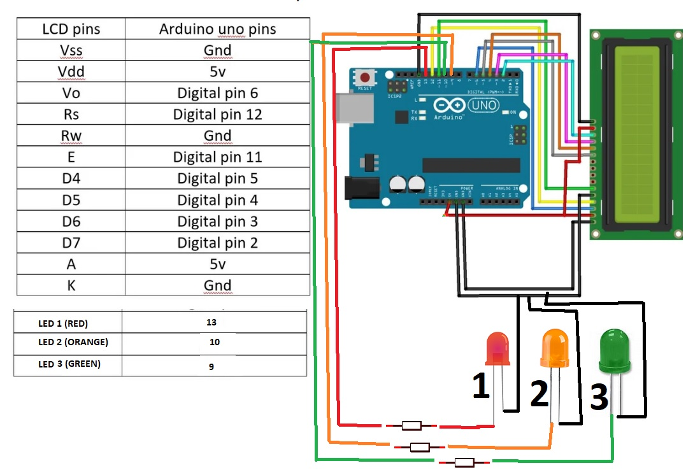

# ircduino
IRC Connected LCD/LED using Arduino

This is initially just a fun project. You connect to an IRC server, join a channel and send commands to an IRC connected Arduino UNO board that has 3 LEDs (Green, Red, Orange) and a 16x2 LCD screen. You can watch this on a live stream on YouTube and the link is provided in the channel because it changes. 

<b>Connect to IRC with below details:</b> 

IRC Server: irc.freenode.net 
IRC Port: 6667 
IRC Channel: ##robot 
 
Once you join the ##robot channel you can type @help to see available commands as below: 
IRC Arduino LCD/LED Control System v1.1: 
@help - to show this help menu. 
@LED<number> - to control LEDs. 
@LCD1<text> - Print to LCD, first line. 
@LCD2<text> - Print to LCD, second line. 
@LCDCLR - Clear the LCD. 
Available LEDs:. 
Green LED - Command: @LED1. 
Red LED - Command @LED2. 
Orange LED - Command @LED3. 
You can control multiple LEDs for ex: @LED123. 
 
New ideas and code changes/pull requests are welcomed. You can see both the IRC bot code and the Arduino C code as well. 
 
<b>Components used:</b> 
-Arduino UNO 
-Qapass 1602a 16x2 LCD screen 
-3 LEDs (Green, Red, Orange) 
-3 resistors 
-Jumper wires 
-GL-36 Breadboard 
-USB cable (serial/power) 
-Computer connected the Arduino via USB cable 
 
<b>Code:</b> 
-IRC Bot v1.0: Python 2.7 
-Arduino v1.0: Arduino C 
 
<b>Circuit Diagram:</b> 

